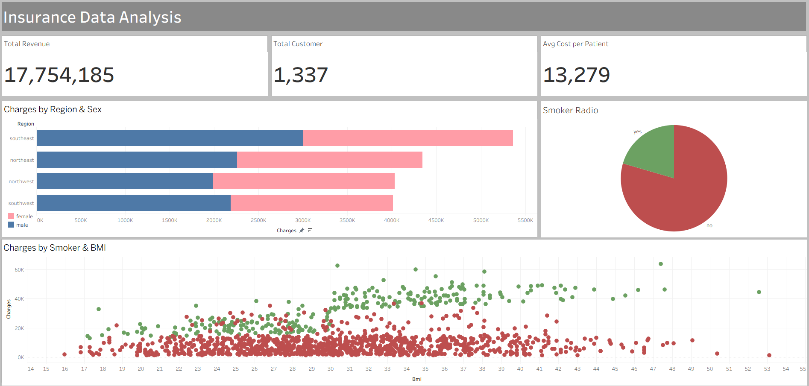

# Insurance Data Analysis

An end-to-end data analytics project combining **Python (Pandas, Seaborn)** for Exploratory Data Analysis (EDA), 
data migration via **SQLAlchemy**, **Advanced SQL (PostgreSQL)** to uncover key financial drivers and demographic trends in health insurance costs,
and visualisation via Tableau to provide an executive summary of the findings.

## 📋 Project Overview
This project analyzes health insurance customer data to understand how various demographic and lifestyle behaviors—such as smoking, BMI, age, and geographic location—impact medical charges. 

The workflow is divided into three key phases:
1. **Exploratory Data Analysis (Python):** Cleaned data, visualized distributions, and analyzed correlations between key attributes and medical charges.
  1.1. **Database Migration:** Loaded the processed dataset into a PostgreSQL database utilizing `SQLAlchemy`.
2. **Advanced SQL Analysis:** Formulated complex queries (window functions, CTEs, conditional logic) to extract deep financial insights and group risk factors.
3. **Dashboard Visualization:** Developed an interactive data dashboard providing a high-level executive summary of the findings.

---

## 📊 Dataset Features
The dataset contains information on insurance policyholders with the following columns:
* **age**: Age of primary beneficiary
* **sex**: Insurance contractor gender (female, male)
* **bmi**: Body Mass Index, providing an understanding of body weight relative to height
* **children**: Number of children covered by health insurance / Number of dependents
* **smoker**: Smoking status (yes, no)
* **region**: The beneficiary's residential area in the US (northeast, southeast, southwest, northwest)
* **charges**: Individual medical costs billed by health insurance

---

## 🛠️ Tech Stack & Libraries
* **Language:** Python, SQL
* **Data Manipulation:** pandas
* **Data Visualization:** matplotlib, seaborn
* **Database Connection:** sqlalchemy, psycopg2
* **RDBMS:** PostgreSQL
* **BI Tool:** Tableau

---

## 💡 Key Analytical Questions & SQL Implementation

### 1. Financial Impact of Smoking
* **Objective:** Determine the proportion of total insurance revenue and average costs driven by smokers vs. non-smokers.
* **SQL Logic:** Utilizes Common Table Expressions (CTEs) and window functions (`SUM() OVER()`) to compute total revenue share.

### 2. BMI Cost Analysis
* **Objective:** Check if insurance charges align with health risk groups by categorizing customers into standard BMI groups (`Underweight`, `Normal`, `Overweight`, `Obese`) and calculating average charges.
* **SQL Logic:** Categorization through `CASE WHEN` conditional statements.

### 3. Identifying High-Cost Outliers (Top 5%)
* **Objective:** Identify the profiles of the top 5% highest-cost customers to understand what drives extreme claims.
* **SQL Logic:** Employs `PERCENT_RANK() OVER (ORDER BY charges DESC)` to filter out top-tier spenders.

### 4. Risk Factor Combinations (Smoker vs. Obesity)
* **Objective:** Find the average charges for cross-segmented cohorts (e.g., Obese Smokers vs. Obese Non-Smokers) to isolate compounding risks.

### 5. High-Risk Regional Concentration
* **Objective:** Identify which geographic region has the highest density of high-risk customers (Smokers who are also Obese).
* **SQL Logic:** Employs `RANK() OVER (ORDER BY COUNT(*) DESC)` grouped by region.

